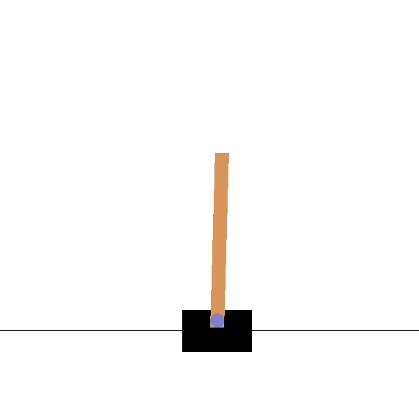

# Hello-Reinforcement-Learning
This is a super basic repository that documents my journey of getting into reinforcement learning

## Why does this repository exist
As the name suggests, this repository is my hello world in reinforcement and as such every thing here is very simple and leverages the work from preexisting libraries.

## Credits
For this exercise I followed
Nicholas Renotte's tutorial [video](https://www.youtube.com/watch?v=Mut_u40Sqz4&ab_channel=NicholasRenotte). Most of the work for this task was built using [Stable Baselines 3](https://stable-baselines3.readthedocs.io/en/master/) and [OpenAI Gym](https://gym.openai.com/)

## How do things work
### Objective
The objective of this exercise is to keep a Cartpole stable for as long as possible. A Cartpole is a pendulum with a centre of gravity above its pivot point. It's unstable, but can be controlled by moving the pivot point under the centre of mass.

### Details  
We will use Proximal Policy Optimization (PPO) to train the cartpole to be stable for as long as possible. At any given step the cartpole can only make one of two actions i.e. move left or right. Once the centre of mass of the cartpole shifts outside the cartpole body we consider this a losing state.

